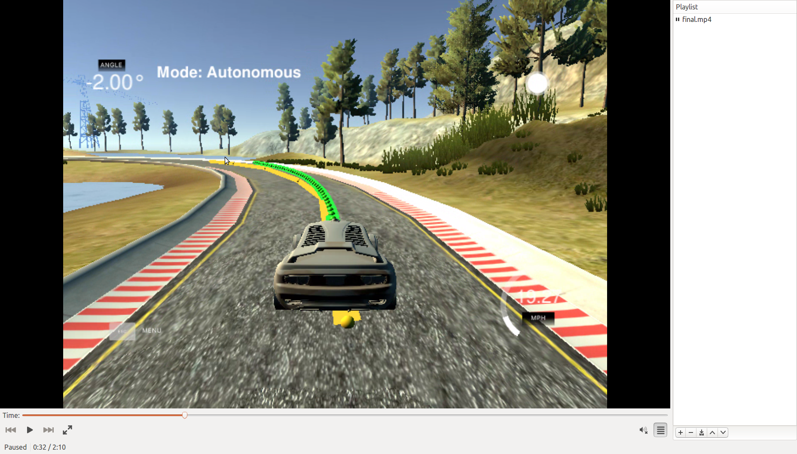
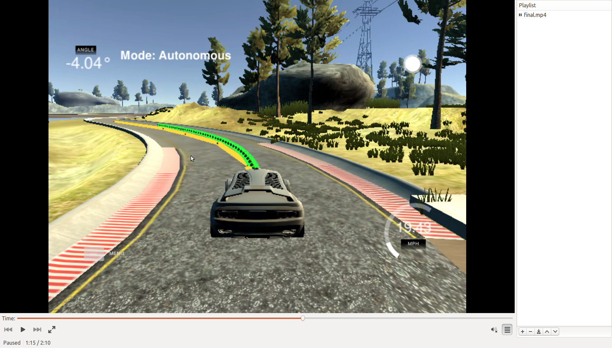
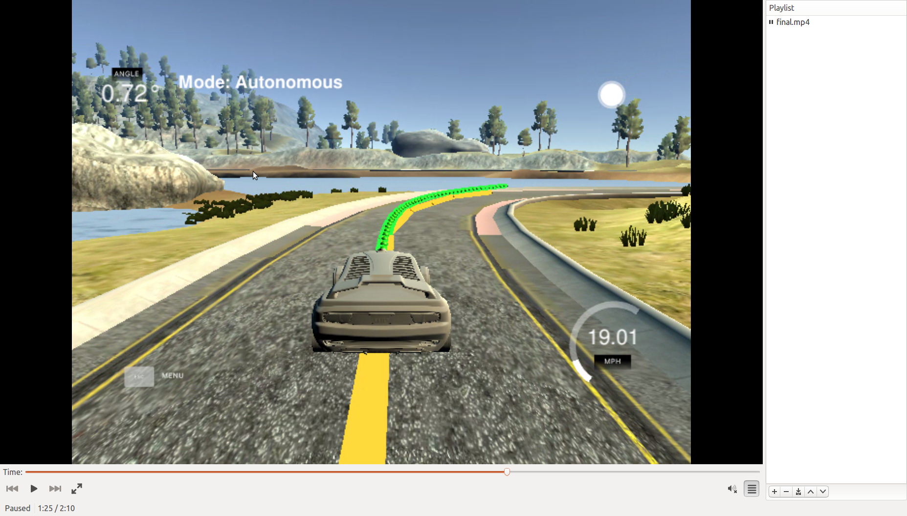
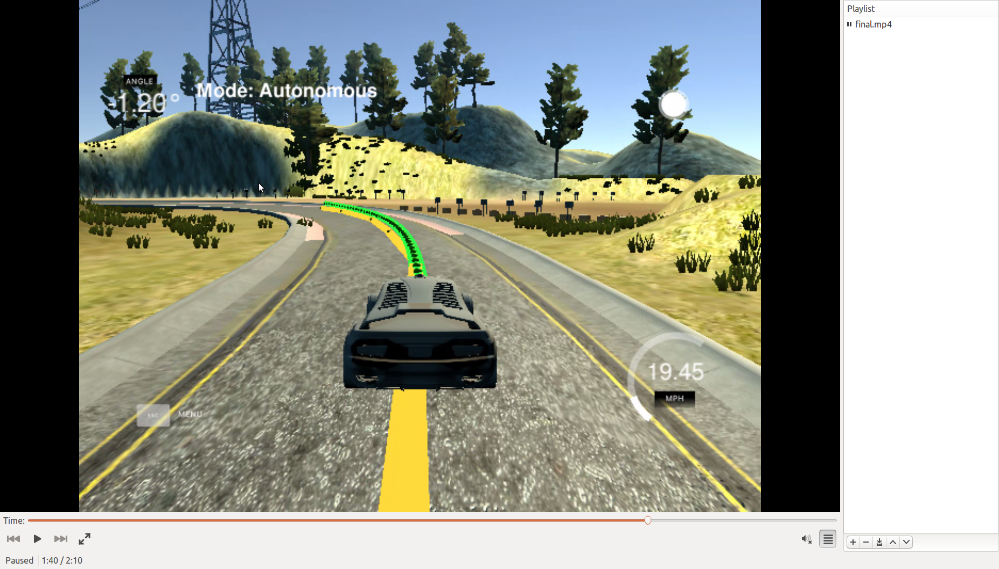

# CarND-Controls-MPC
Self-Driving Car Engineer Nanodegree Program

---

## Model

My implementation of MPC follows very closely the example taught in the class. But I've made several modifications in order to complete the project.

For the state vector, I follow the class to use 6 variables: `x, y, psi, v, cte, epsi`. There are two control inputs: `delta` for steering angle and `a` for throttle.

My cost function includes `cte`, `epsi`, v error, control input magnitude and control input first derivative. The reason to include the latter is to provide smoother controls. This is especially helpful to reduce oscillation behavior.

The update equations are basically constant acceleration and turn rate equations.


## Changes
- In order to calculate reference heading angle, I implemented a function `polyeval_dot` which calculates the first derivative of a polynomial.
- Because velocity is measured in mph but distance in meter, I need to convert velocity to m/s by multiplying a factor of 0.44704. Similarly for acceleration.
- Negative steering control == steer left, which increases heading angle. Therefore it is necessary to negative the steering angle inside motion update equations.
- epsi must be normalized to between -pi/2 and +pi/2.
- Coordinate transform:
  - waypoints are given in global coordinates, but MPC requires local coordinates. Therefore it is necessary to do a coordinate transform. Here are the equations:
  ```
  P_global = R * P_local + T
  P_local = R_inv * (P_global-T)
  ```
  Here `R` and `T` are rotation and translation from global to local coordinates. They can be readily computed from px, py and psi.
  
- For MPC parameters, I chose N = 50, dt = 0.1. This translates to 5s of time horizon. And N=50 is not too computationally intensive.
- For smooth control and trajectory, I used large weights for actuations and actuation derivatives in the cost function.

## Screenshots




